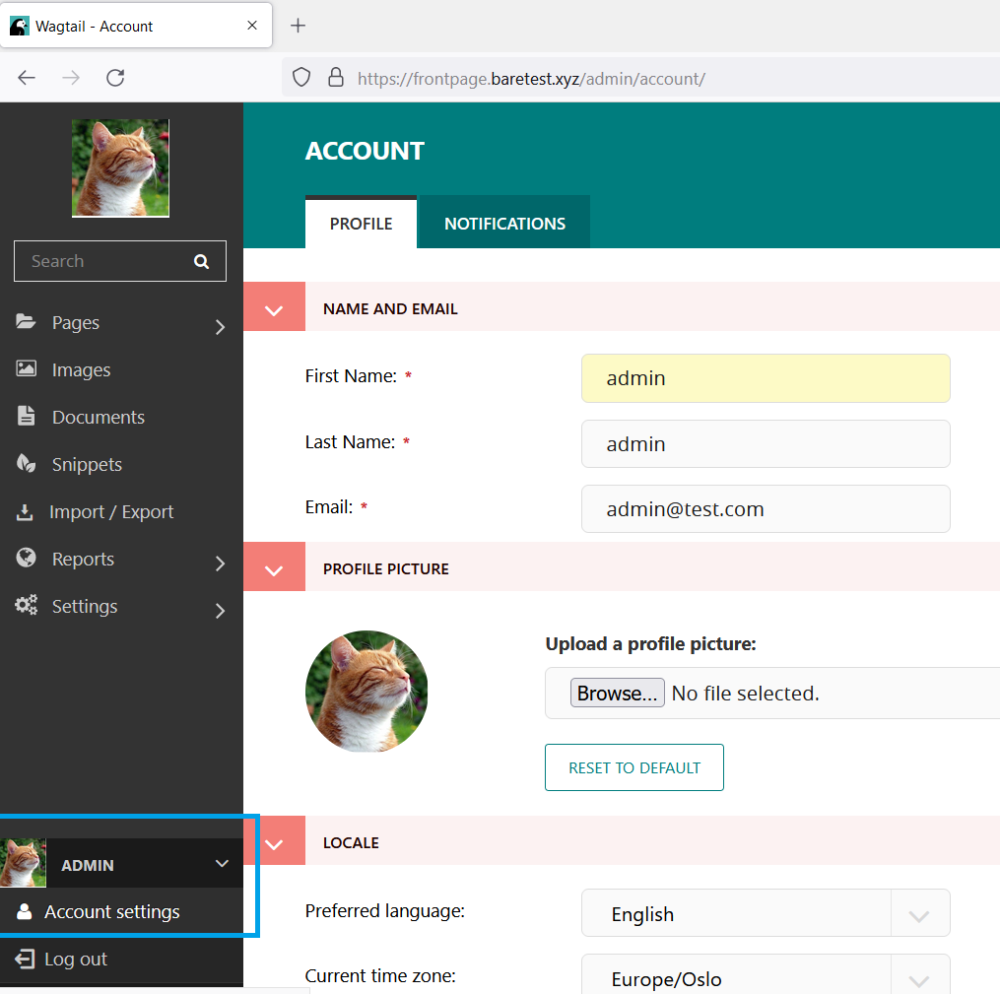
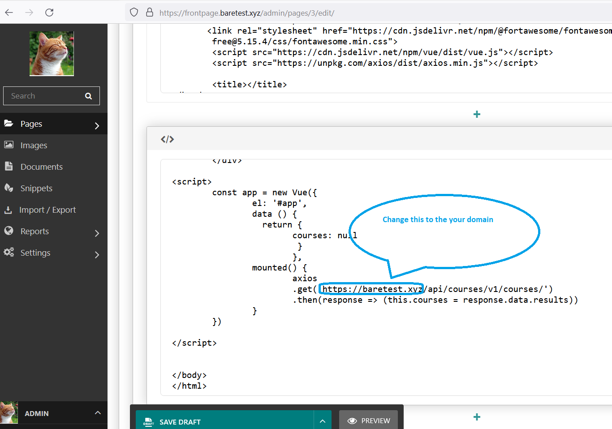
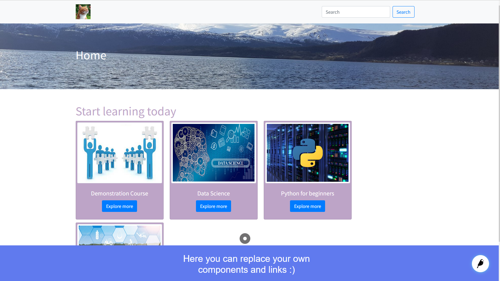

This is a plugin for Tutor Open edX, and can be used for marketing and other educational purposes.
It's easy to install and customize like WordPress. Because plugins based of Wagtail and CodeRed CMS. Thanks a lot to the Vince Salvino :) https://github.com/coderedcorp/coderedcms 

### Installation:

First of all you must add an A record to the your DNS management. Bacause Frontpage runs as a subdomain of your LMS_HOST. For example: if your domain is https://myedx.com so your marketing site will be https://frontpage.myedx.com 

`pip3 install  tutor-contrib-frontpage`

`tutor plugins list`

`tutor plugins enable frontpage`

`tutor config save`

`tutor local quickstart`

### optional
If you want to build your own images:

`tutor images build frontpage`

` tutor local quickstart`

Go to https://frontpage.YourDomain.com

## Customization:

- Login as a superuser:
  go to https://frontpage.YourDomain.com/admin
  username = admin

  password = admin

  than change your password and admin profile

  

- Fatching your courses from LMS API, by 
  using VueJS and Axios:
  To do this change your URL(LMS/domain)

  Pages => Home => Edit

  than change your API URL(your domain)

  

  and check it with " Preview " and " Publish" it.

  

  Other custumuzations are very easy, like Wordpress Gutenberg. Here is the documentations https://docs.coderedcorp.com/cms/

  

